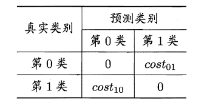
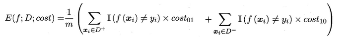
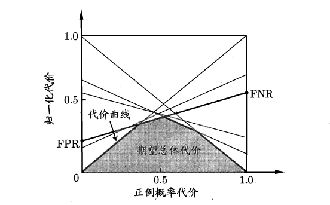
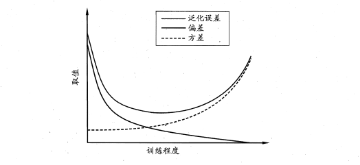

### 误差
- 训练集上的误差称为训练误差（training error）或**经验误差（empirical error）**
- 在测试集上的误差称为**测试误差（test error）**
- 学习器在所有新样本上的误差称为**泛化误差（generalization error）**

### 过拟合和欠拟合
- 过拟合：训练误差十分小，但测试误差较大
- 欠拟合，训练误差和测试误差都比较大

### 数据集划分
1. 留出法
    - 尽可能保持数据分布的一致性（分层抽样）；若干次随机划分，取平均值
2. 交叉验证

    

    - K折交叉验证通常也要**重复p次**，称为p次k折交叉验证
    - 每个子集中只有一个样本时，称为**留一法**
3. 自助法
    - 给定包含m个样本的数据集D，每次随机从D 中挑选一个样本，将其拷贝放入D'，然后再将该样本放回初始数据集D 中，使得该样本在下次采样时仍有可能被采到

    

    - 改变了初始数据集的分布（随机抽样），引入估计偏差
    - 适用于**小数据集**

### 性能度量
1. MSE
2. 错误率和精度
    - 错误率是分类错误的样本数占样本总数的比例，精度则是分类正确的样本数占样本总数的比例
    - $Accuracy=\frac{TP+TN}{TP+FP+TN+FN}$
3. 查准率($Precision$)/查全率($Recall$)/$F1$
    - $P=\frac{TP}{TP+FP}$
    - $R=\frac{TP}{TP+FN}$
    - P-R曲线

    

    - 平衡点(BEP)的取值越高，性能更优。
    
    

    - $F1=\frac{2\times P\times R}{P+R}=\frac{2\times TP}{样例总数+TP-TN}$

      - macro & micro

      
    
4. ROC & AUC
    - $TPR=\frac{TP}{TP+FN}=Recall$
    - $FNR=\frac{FN}{TP+FN}=1-TPR$
    - $TNR=\frac{TN}{TN+FP}$
    - $FPR=\frac{FP}{TN+FP}=1-TNR$
 
    

    

    - AUC越大，证明排序的质量越好，AUC为1时，证明**所有正例排在了负例的前面**，AUC为0时，所有的**负例排在了正例的前面**
    - $AUC=\frac{1}{2}\sum_{i=1}^{m-1}(x_{i+1}-x_{i})\cdot(y_{i}+y{i+1})$

### 代价敏感错误率与代价曲线

0为正类，1为负类

- 代价敏感错误率
  - 
  - 
- 代价曲线
  - 正例概率代价
    - $P(+)cost=\frac{p\times cost_{+-}}{p\times cost_{+-} + (1 - p)\times cost_{-+}}$
    - 
    - 无论代价敏感还是不敏感，$P(+)cost$本质上表示的都是**样例集中正例的占比**
  - 归一化代价
    - 对于包含m个样本的样例集$D$，可以算出学习器$f(x)$总的代价是
      - 
      - $m×p×FNR$表示正例被预测为反例（正例预测错误）的样本个数
      - $m×(1−p)×FPR$表示反例被预测为正例（反例预测错误）的样本个数；
      - $m×p×TPR$表示正例被预测为正例（正例预测正确）的样本个数；
      - $m×(1−p)×TNR$表示反例预测为反例（反例预测正确）的样本个数
      - $cost_{se}=m\times f(E;D;cost), 当cost_{++}=cost_{--}=0时$
    - $cost_{norm}=\frac{cost_{se}}{max(cost_{se})}=\frac{p\times FNR \times cost_{+-} + (1 - p)\times FPR\times cost_{-+}}{p\times cost_{+-} + (1 - p)\times cost_{-+}}=FNR\times P(+)cost+FPR\times P(-)cost, 其中P(-)cost=1-P(+)cost$
  - 
  - 

### 比较检验
1. 假设检验
    - 可以通过测试获得测试错误率，但直观上测试错误率和泛化错误率相差不会太远，因此可以通过测试错误率来推测泛化错误率的分布，这就是一种假设检验。
2.  交叉验证t检验
    - 

### 偏差与方差
偏差方差分解试图对学习算法的期望泛化错误率进行拆解.我们知道，**算法在不同训练集上学得的结果很可能不同，即便这些训练集是来自同一个分布**.对测试样本$x$令$y_D$为$x$在数据集中的标记，$y$为$x$的真实标记，$f(x; D)$为训练集$D$上学得模型$f$在$x$上的预测输出
- 期望预测：$\overline{f}(x)=\mathbb{E}_{D}[f(x;D)]=\frac{1}{n}(f(x;D_1)+...+f(x;D_n))$
- 使用**样本数相同的不同训练集**产生的方差：$var(x)=\mathbb{E}_{D}[(f(x;D)-\overline{f}(x))^2]=\frac{1}{n}((f(x;D_1)−\overline{f}(x))^2+...+(f(x;D_n)−\overline{f}(x))^2)$
- 噪声：$\varepsilon^2=\mathbb{E}_{D}[(y_D-y)^2]=\frac{1}{n}((y_{D_1}−y)^2+...+(y_{D_n}-y)^2)$
- 偏差($bias$)：$bias^2(x)=(\overline{f}(x)-y)^2$
- $E(f;D)=bias^2(x)+var(x)+\varepsilon^2$
- 

- 偏差刻画了学习器的**拟合能力**——**欠拟合**
- 方差体现了**数据扰动所造成的影响**——**过拟合**
- 噪声表达了在当前任务上任何学习算法**所能达到的期望泛化误差的下界**

