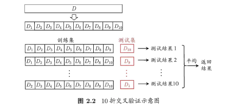

### 误差
- 训练集上的误差称为训练误差（training error）或**经验误差（empirical error）**
- 在测试集上的误差称为**测试误差（test error）**
- 学习器在所有新样本上的误差称为**泛化误差（generalization error）**

### 过拟合和欠拟合
- 过拟合：训练误差十分小，但测试误差较大
- 欠拟合，训练误差和测试误差都比较大

### 数据集划分
1. 留出法
    - 尽可能保持数据分布的一致性（分层抽样）；若干次随机划分，取平均值
2. 交叉验证

    

    - K折交叉验证通常也要**重复p次**，称为p次k折交叉验证
    - 每个子集中只有一个样本时，称为**留一法**
3. 自助法
    - 给定包含m个样本的数据集D，每次随机从D 中挑选一个样本，将其拷贝放入D'，然后再将该样本放回初始数据集D 中，使得该样本在下次采样时仍有可能被采到

    

    - 改变了初始数据集的分布（随机抽样），引入估计偏差
    - 适用于**小数据集**

### 性能度量
1. MSE
2. 错误率和精度
    - 错误率是分类错误的样本数占样本总数的比例，精度则是分类正确的样本数占样本总数的比例
    - $Accuracy=\frac{TP+TN}{TP+FP+TN+FN}$
3. 查准率($Precision$)/查全率($Recall$)/$F1$
    - $P=\frac{TP}{TP+FP}$
    - $R=\frac{TP}{TP+FN}$
    - P-R曲线

    

    - 平衡点(BEP)的取值越高，性能更优。
    
    

    - $F1=\frac{2\times P\times R}{P+R}=\frac{2\times TP}{样例总数+TP-TN}$

      - macro & micro

      
    
4. ROC & AUC
    - $TPR=\frac{TP}{TP+FN}=Recall$
    - $FNR=\frac{FN}{TP+FN}=1-TPR$
    - $TNR=\frac{TN}{TN+FP}$
    - $FPR=\frac{FP}{TN+FP}=1-TNR$
 
    

    

    - AUC越大，证明排序的质量越好，AUC为1时，证明**所有正例排在了负例的前面**，AUC为0时，所有的**负例排在了正例的前面**
    - $AUC=\frac{1}{2}\sum_{i=1}^{m-1}(x_{i+1}-x_{i})\cdot(y_{i}+y{i+1})$