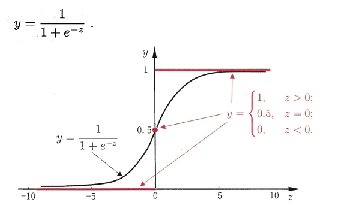

- [线性模型](#线性模型)
  - [线性回归](#线性回归)
    - [属性值处理](#属性值处理)
    - [多元线性回归](#多元线性回归)
    - [广义线性模型](#广义线性模型)
  - [线性几率回归（逻辑回归）](#线性几率回归逻辑回归)
  - [线性判别分析](#线性判别分析)
  - [多分类学习](#多分类学习)
  - [类别不平衡问题](#类别不平衡问题)

# 线性模型
## 线性回归
### 属性值处理
- 连续值的属性：归一化
- 离散值的属性
  - 存在“序关系”，则可以将其转化为连续值，例如：身高属性分为“高”，“中等”，“矮”，可转化为数值：$\{1,0.5,0\}$。
  - 不存在“序关系”，则通常将其转化为向量的形式，例如：性别属性分为“男”，“女”，可转化为二维向量：$\{(1,0),(0,1)\}$。

### 多元线性回归

然而，现实任务中$\rm X^TX$往往不是满秩矩阵.例如在许多任务中我们会遇到大量的变量，其数目甚至超过样例数，导致$\rm X$的列数多于行数， $\rm X^TX$显然不满秩.此时可解出多个解，它们都能使均方误差最小化.选择哪一个解作为输出，将由学习算法的归纳偏好决定， 常见的做法是**引入正则化(regularization)项**.

### 广义线性模型

$y=g^{-1}(w^Tx+b)$

$g(\cdot)$称为**联系函数(link function)**。显然**对数线性回归**是广义线性模型在$g(\cdot)=ln(\cdot)$时的特例.

## 线性几率回归（逻辑回归）

## 线性判别分析

$y=w^{\rm T}x$

> 由向量内积的几何意义可知，$y$可以看作是$x$在$w$上的投影

线性判别分析（Linear Discriminant Analysis，简称**LDA**）,其基本思想是：**将训练样本投影到一条直线上，使得同类的样例尽可能近，不同类的样例尽可能远**。

- 类内散度矩阵（within-class scatter matrix）
  

- 类间散度矩阵(between-class scatter matrix)
  

- LDA的最大化目标：“广义瑞利商”（generalized Rayleigh quotient）
  

从而分类问题转化为**最优化求解$w$的问题**，当求解出w后，对新的样本进行分类时，**只需将该样本点投影到这条直线上，根据与各个类别的中心值进行比较，从而判定出新样本与哪个类别距离最近**。

- 求解$w$的方法--$\lambda$乘子
  > 由于最终要求解的w不关心其大小，只关心其方向，所以其大小可以任意取值。

  
  

若将$w$看做一个投影矩阵，类似PCA的思想，则LDA**可将样本投影到N-1维空间（N为类簇数）**，投影的过程使用了类别信息（标记信息），因此LDA也常被视为一种经典的**监督降维技术**。

## 多分类学习
通过多个二分类学习器来解决多分类问题，即**将多分类问题拆解为多个二分类问题**，训练出多个二分类学习器，最后将多个分类结果进行集成得出结论。

- OvO（一对一）：给定数据集$D$，假定其中有$N$个真实类别，将这**N个类别进行两两配对（一个正类/一个反类），从而产生$N(N-1)/2$个二分类学习器**，在测试阶段，将新样本放入所有的二分类学习器中测试，得出$N(N-1)/2$个结果，最终通过投票产生最终的分类结果。

- OvM（一对其余）：给定数据集$D$，假定其中有$N$个真实类别，**每次取出一个类作为正类，剩余的所有类别作为一个新的反类，从而产生$N$个二分类学习器**，在测试阶段，得出$N$个结果，**若仅有一个学习器预测为正类，则对应的类标作为最终分类结果**。

- MvM（多对多）：给定数据集$D$，假定其中有$N$个真实类别，**每次取若干个类作为正类，若干个类作为反类**（通过ECOC码给出，编码），若进行了$M$次划分，则生成了$M$个二分类学习器，在测试阶段（解码），得出M个结果组成一个新的码，最终通过**计算海明/欧式距离选择距离最小的类别作为最终分类结果**。

> 为什么称为"纠错输出码"呢?这是因为在测试阶段， ECOC编码对分类器的错误有一定的容忍和修正能力

> “海明距离”是指两个码对应位置不相同的个数，“欧式距离”则是指两个向量之间的欧氏距离

> 在计算海明距离时，与“停用类”不同算作0.5

## 类别不平衡问题
1. 在训练样本较多的类别中进行“**欠采样**”（undersampling）,比如从正例中采出100个，常见的算法有：EasyEnsemble。
2. 在训练样本较少的类别中进行“**过采样**”（oversampling）,例如通过对反例中的数据进行插值，来产生额外的反例，常见的算法有SMOTE。
3. 直接基于原数据集进行学习，对预测值进行“**再缩放**”处理。其中再缩放也是代价敏感学习的基础。
   