- [聚类算法](#聚类算法)
  - [距离度量](#距离度量)
  - [性能度量](#性能度量)
    - [外部指标](#外部指标)
    - [内部指标](#内部指标)
  - [原型聚类](#原型聚类)
    - [K-Means](#k-means)
    - [学习向量量化（LVQ）](#学习向量量化lvq)
    - [高斯混合聚类](#高斯混合聚类)
  - [密度聚类](#密度聚类)
    - [DBSCAN](#dbscan)
  - [层次聚类](#层次聚类)
    - [AGNES](#agnes)
# 聚类算法
> 无监督学习的目标是通过对**无标记**训练样本的学习，发掘和揭示数据集本身**潜在的结构与规律**
>
> 聚类则是试图将数据集的样本划分为**若干个互不相交的类簇**，从而每个簇对应一个潜在的类别。

## 距离度量
- 满足的基本性质
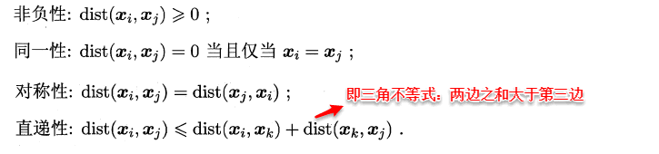
- “闵可夫斯基距离”（Minkowski distance)：
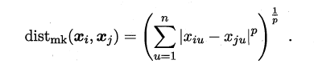
  - 曼哈顿距离（Manhattan distance）：$p=1$
  - 欧氏距离（Euclidean distance）：$p=2$

在进行距离度量时，易知**连续属性和存在序关系的离散属性都可以直接参与计算，因为它们都可以反映一种程度**，我们称其为“**有序属性**”；而对于不存在序关系的离散属性，我们称其为：“**无序属性**”，显然无序属性再使用闵可夫斯基距离就行不通了，采用VDM计算距离。 

- VDM($a,b$为离散属性的两个取值)
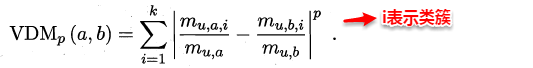

- 混合计算公式
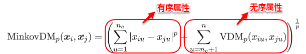

- 用于相似度度量的距离未必一定要满足距离度量的所有基本性质，尤其是直递性

## 性能度量
### 外部指标
- 聚类结果与某个参考模型的结果进行比较
  - 假设聚类给出的结果为$λ$，参考模型给出的结果是$λ*$
  - 将样本进行两两配对，定义:
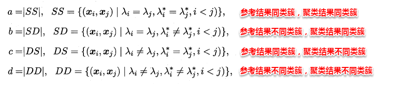
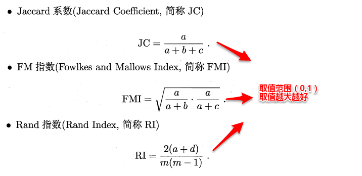

### 内部指标
> 簇内距离越小越好，簇间距离越大越好

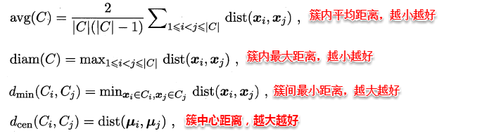
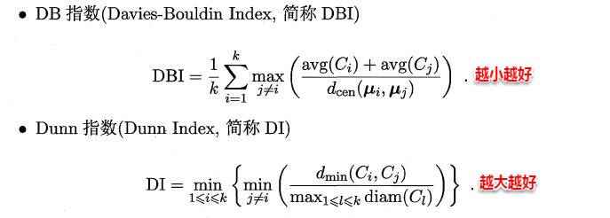

## 原型聚类
原型表示模板的意思，就是**通过参考一个模板向量或模板分布的方式来完成聚类的过程**，常见的K-Means便是基于簇中心来实现聚类，混合高斯聚类则是基于簇分布来实现聚类。

### K-Means
首先**随机指定类中心**，根据样本与类中心的远近划分类簇，接着重新计算类中心，迭代直至收敛。

根本的目的是为了最小化平方误差函数$E$:

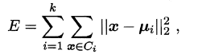

算法流程:

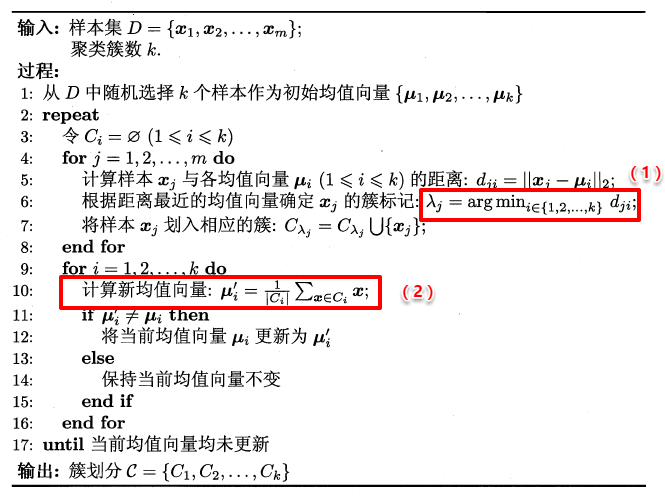

###  学习向量量化（LVQ）
LVQ**使用样本真实类标记**辅助聚类，首先LVQ根据样本的类标记，**从各类中分别随机选出一个样本作为该类簇的原型**，从而组成了一个**原型特征向量组**，接着从样本集中**随机挑选一个样本，计算其与原型向量组中每个向量的距离**，并选取距离最小的原型向量所在的类簇作为它的划分结果，再与真实类标比较。
- 若划分结果正确，则对应原型向量向这个样本靠近一些
- 若划分结果不正确，则对应原型向量向这个样本远离一些

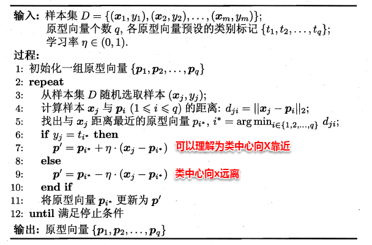
> 停止条件：迭代次数达到预设值；误差收敛等

### 高斯混合聚类
假设每个类簇中的样本**都服从一个多维高斯分布**，那么空间中的样本可以看作由**k个多维高斯分布混合而成**。

多维高斯分布的概率密度函数：

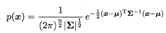

其中u表示均值向量，∑表示协方差矩阵，可以看出一个多维高斯分布完全由这两个参数所确定。接着定义高斯混合分布为：

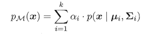

α称为混合系数，这样空间中样本的采集过程则可以抽象为：（1）先选择一个类簇（高斯分布），（2）再根据对应高斯分布的密度函数进行采样

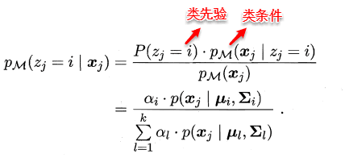

[todo]

## 密度聚类
它从样本分布的角度来考察样本之间的**可连接性**，并基于可连接性（密度可达）不断拓展疆域（类簇）

### DBSCAN
> 前面介绍的聚类算法只能产生“凸聚类”，而DBSCAN则能产生“非凸聚类”

基本概念：
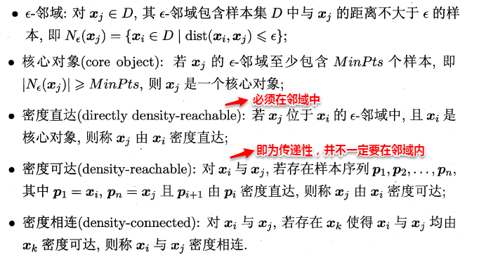
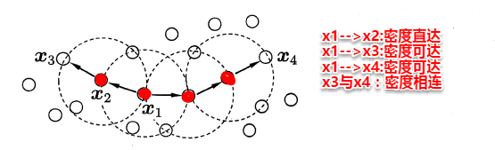

基本思想：找出一个**核心对象**所有**密度可达**的样本集合形成簇。

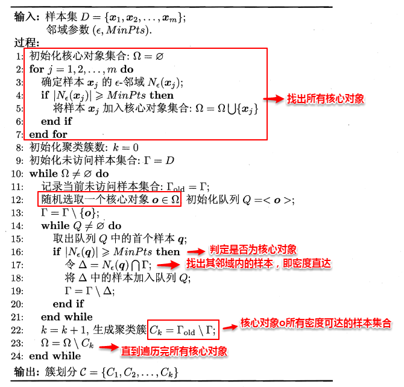
> 符号“\”为集合求差

## 层次聚类
一种基于树形结构的聚类方法，常用的是**自底向上**的结合策略（AGNES算法）

### AGNES
1. 初始化-->**把每个样本归为一类**，**计算每两个类之间的距离**，也就是样本与样本之间的相似度；
2. 寻找各个类之间最近的两个类，把他们归为一类（这样类的总数就少了一个）；
3. 重新计算**新生成的这个类与各个旧类之间的相似度**；
4. 重复2和3直到剩下k个类别，结束。

算法流程：

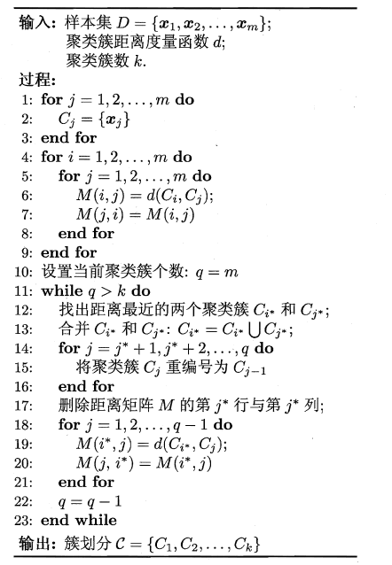

聚类簇距离度量函数d:
- 单链接（single-linkage）:取类间最小距离。
- 全链接（complete-linkage）:取类间最大距离
- 均链接（average-linkage）:取类间两两的平均距离